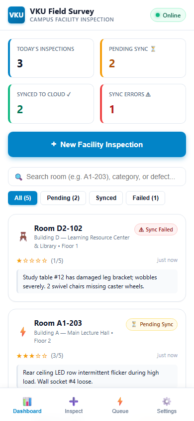
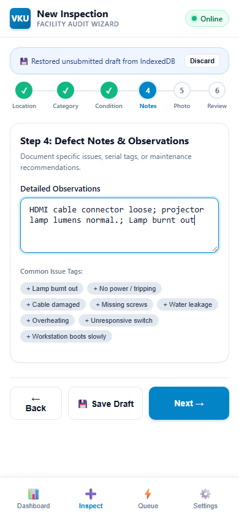
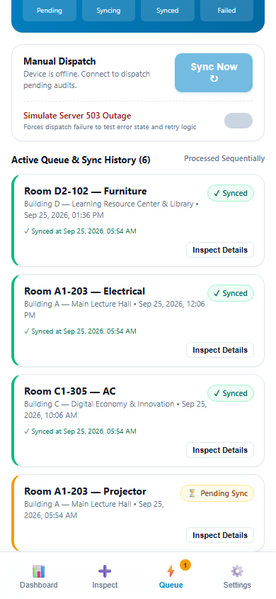
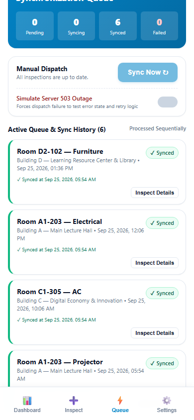

# MINI-PROJECT SHORT TECHNICAL REPORT
**Course:** Cross-Platform Mobile App Development (VKU)  
**Mini-Project Title:** VKU Field Survey — Offline-First Campus Facility Inspection PWA with Capacitor Android Bridge  
**Team / Student Name:** Lê Hữu Thái — 23IT.EB091  
**Submission Date:** 25/09/2026  

---

## 1. GENERAL INFORMATION & DELIVERABLE LINKS

* **Team Members:**
  1. Lê Hữu Thái — Student ID: 23IT.EB091 — Role: [Solo Developer / Frontend Architecture & Native Bridge] — Contribution: [100%]
* **🔗 Live Demo URL:** `https://vku-field-survey-lehuuthai57-4276.vercel.app/`
* **💻 GitHub Repository:** `https://github.com/HuuThai127/vku-field-survey`
* **📦 Compiled Debug APK (Local Build Artifact):** `android/app/build/outputs/apk/debug/app-debug.apk`
* **🎥 Video Demo (Optional):** `https://drive.google.com/file/d/1p2it_gP0H_YPpVJJ_Gke55EXWm2o7oky/view?usp=sharing`

---

## 2. FEATURE IMPLEMENTATION CHECKLIST

| # | Required Feature | Status | Implementation Details & Acceptance Level |
|:---:|---|:---:|---|
| 1 | **Responsive Mobile UI & Campus Views** | Complete | Mobile-first viewport layout with sticky header, network badge, bottom navigation, and dedicated views: Dashboard, Multi-Step Inspection Wizard, Sync Queue, Inspection Detail, and Settings. |
| 2 | **100% Offline-First App Shell (PWA)** | Complete | `public/sw.js` caches all static assets (`vku-survey-shell-v1`) via a Cache-First strategy. `public/manifest.json` configures `display: standalone`, `#0284c7` theme color, and 192x192 / 512x512 icons. Boots with zero network connectivity. |
| 3 | **Multi-Step Inspection Wizard & Real-Time Drafting** | Complete | 6-step form: Location (Buildings A, B, C, D, K), Category, Subcategory, Condition Rating (1–5 stars), Defect Notes, and Photo Capture. Every input change auto-saves to IndexedDB (`appMetadata.activeDraft`), surviving accidental browser refresh or page closure. |
| 4 | **Client-Side Persistence via IndexedDB (`idb`)** | Complete | Structured local database using `idb` with three stores: `inspections` (keyed by UUID), `syncQueue` (keyed by UUID), and `appMetadata` (active draft and settings). Automatically seeds deterministic sample data for Buildings A, B, and C on first launch. |
| 5 | **Sequential FIFO Offline Sync Queue** | Complete | Submissions created offline receive `PENDING_SYNC` status and enter `syncQueue`. Upon reconnection or manual sync trigger, items process sequentially: `PENDING_SYNC -> SYNCING -> SYNCED`. If network/server failure occurs, status transitions to `FAILED` with retry tracking. |
| 6 | **Capacitor 7 Native Android Integration** | Complete | Cross-platform bridge configured with Capacitor 7.6.9. `@capacitor/network` provides native connection status; `@capacitor/camera` provides native camera capture with web file input fallback. Android project generated and verified with Gradle. |
| 7 | **Automated Unit Testing** | Complete | Vitest suite containing 15 automated unit tests across 4 test suites (`tests/validation.test.ts`, `tests/storage.test.ts`, `tests/queue.test.ts`, `tests/repository.test.ts`). All 15 tests pass (15/15 PASS). |

---

## 3. TECHNICAL ARCHITECTURE & PROJECT STRUCTURE

### 3.1 Architecture Overview
The application follows a layered, framework-agnostic architecture implemented in Vanilla TypeScript and modular CSS:

```
[Presentation Layer: Vanilla TypeScript UI Components & Pages]
                          │
       ┌──────────────────┴──────────────────┐
       ▼                                     ▼
[Hardware Abstraction Services]    [Offline & Persistence Engine]
 - NetworkService                   - InspectionRepository
   (@capacitor/network / online)     - SyncQueueManager (FIFO Loop)
 - CameraService                    - DraftStorage (Auto-Save)
   (@capacitor/camera / <input>)     - IndexedDB (idb wrapper)
       │                                     │
       └──────────────────┬──────────────────┘
                          ▼
[Platform Delivery: PWA Service Worker (sw.js) & Capacitor Android Shell]
```

### 3.2 Directory Structure
```
vku-field-survey/
├── android/                   # Native Android platform project (Gradle wrapper)
├── public/
│   ├── icons/                 # PWA application icons (192x192, 512x512)
│   ├── manifest.json          # PWA web app manifest (standalone, theme #0284c7)
│   └── sw.js                  # Service Worker with Cache-First app shell caching
├── report/
│   ├── technical-report.md    # VKU Course Short Technical Report
│   └── technical-report.html  # Exported HTML version of technical report
├── screenshots/               # Empirical evidence captures
├── src/
│   ├── components/            # Reusable UI components (Cards, Badges, Header, Rating)
│   ├── constants/             # Campus buildings (A, B, C, D, K), categories, defaults
│   ├── pages/                 # Page controllers (Dashboard, NewInspection, Queue, Settings)
│   ├── services/              # Hardware and repository abstractions (Camera, Network, Repo)
│   ├── storage/               # IndexedDB setup, draft storage, queue storage
│   ├── styles/                # Mobile CSS, design tokens, responsive typography
│   ├── sync/                  # Sequential sync queue and mock server adapter
│   ├── types/                 # TypeScript interfaces (Inspection, SyncQueueItem, Draft)
│   ├── utils/                 # UUID generator, date formatting helpers
│   └── main.ts                # Application router and entry point
├── tests/                     # 15 Vitest automated test suites
├── capacitor.config.ts        # Capacitor 7 configuration file
└── vite.config.ts             # Vite build configuration
```

### 3.3 Data Flow & State Lifecycle
1. **Inspection Drafting:** As the inspector inputs data, changes are immediately committed to IndexedDB (`appMetadata.activeDraft`).
2. **Submission:** Upon submission, the record is assigned `PENDING_SYNC` and added to both `inspections` and `syncQueue` object stores. The active draft is deleted.
3. **Queue Processing:** If the device is online, `SyncQueueManager` triggers an asynchronous FIFO processing loop:
   - State advances to `SYNCING`.
   - Payload is transmitted to `ServerAdapter`.
   - On success (HTTP 200 simulation), status transitions to `SYNCED` and the item is dequeued.
   - On failure, status transitions to `FAILED`, an error message is recorded, and the item remains available for retry.
4. **Error Handling:** Form inputs are validated prior to progression. Network dropouts do not discard in-flight records; processing suspends gracefully until connectivity is re-established.

---

## 4. EMPIRICAL EVIDENCE & SCREENSHOTS

### Screenshot 1: Dashboard View

*Figure 1: Dashboard displaying live network status badge, facility inspection summary metrics (Total, Synced, Pending Sync, Failed), building quick-filters (Buildings A, B, C, D, K), and recent inspection activity cards.*

### Screenshot 2: Multi-Step Inspection Wizard

*Figure 2: Step 4 of the 6-step Inspection Wizard showing Condition Rating selection (1 to 5 stars), defect description text input, progress bar, and persistent auto-save state.*

### Screenshot 3: Offline Submission Queued (`PENDING_SYNC`)

*Figure 3: Submission completed while offline. The item is saved locally to IndexedDB with status `PENDING_SYNC` and queued in the Sync Queue awaiting network restoration.*

### Screenshot 4: Automatic Synchronization & Verification (`SYNCED`)

*Figure 4: Connection restored. The sequential sync queue successfully dispatches the queued inspection payload, updating state to `SYNCED` with zero data loss.*

---

## 5. TECHNICAL CHALLENGES & RESOLUTIONS

### 5.1 Challenge 1: Offline Persistence & Draft Durability Across Sessions
* **Problem:** Field inspectors navigating lecture halls and basements frequently experience accidental browser reloads or device memory pressure. Losing multi-step form data and captured defects results in lost audit work.
* **Resolution:** Implemented an asynchronous draft auto-save pipeline backed by IndexedDB (`idb`). Each wizard step transition asynchronously saves the partial form state into the `appMetadata` store under the key `activeDraft`. When the inspector returns to the wizard after closing or refreshing the tab, the application detects the persisted draft and automatically restores all previously entered fields and selections.

### 5.2 Challenge 2: Sequential Offline Synchronization & Reconnection Race Conditions
* **Problem:** Rapid intermittent connectivity changes (common when moving between campus Wi-Fi access points) can cause multiple concurrent synchronization triggers, resulting in duplicated transmissions or race conditions in state transition.
* **Resolution:** Engineered a single-flight FIFO queue processor in `src/sync/syncQueue.ts` protected by an `isProcessing` mutual-exclusion flag. Reconnection events from `@capacitor/network` and window `online` listeners trigger queue evaluation with a debounce guard. Items are dispatched strictly one-by-one through deterministic lifecycle states (`PENDING_SYNC -> SYNCING -> SYNCED / FAILED`). If an upstream failure occurs, the item is marked `FAILED` with an error diagnostic without blocking subsequent manual retries.

### 5.3 Challenge 3: Cross-Platform Native Camera & Network Hardware Abstraction
* **Problem:** The application must function seamlessly both as an installable web PWA across desktop/mobile browsers and as a compiled native Android application, each possessing different hardware access capabilities.
* **Resolution:** Encapsulated hardware access within abstraction services (`src/services/cameraService.ts` and `src/services/networkService.ts`). When running inside the Capacitor Android container, `@capacitor/camera` invokes the native Android camera intent and `@capacitor/network` monitors system-level connectivity broadcasts. When running in a standard web browser, the services gracefully fall back to native HTML5 `<input type="file" accept="image/*" capture="environment">` and standard `navigator.onLine` events.

---

## 6. VERIFICATION SUMMARY

| Verification Item | Specification / Command | Result | Acceptance Notes |
|---|---|:---:|---|
| **Web Production Build** | `npm run build` | **PASS** | Vite production bundle generated in `dist/` in 467ms without compilation errors. |
| **Automated Unit Tests** | `npm test` (Vitest) | **PASS** | 15/15 tests passing across 4 suites (`tests/validation.test.ts`, `tests/storage.test.ts`, `tests/queue.test.ts`, `tests/repository.test.ts`). |
| **PWA Manifest & App Shell** | `public/manifest.json`, `public/sw.js` | **PASS** | Standalone display mode, theme `#0284c7`, 192px/512px icons, cache-first Service Worker (`vku-survey-shell-v1`). Loads offline. |
| **IndexedDB Durability** | `src/storage/indexedDb.ts` | **PASS** | `inspections`, `syncQueue`, and `appMetadata` object stores verified for persistence and draft retention. |
| **Offline Sync Flow** | `src/sync/syncQueue.ts` | **PASS** | State transitions (`PENDING_SYNC -> SYNCING -> SYNCED / FAILED`) verified via automated tests and manual network toggling. |
| **Capacitor Configuration** | `npx cap sync android` | **PASS** | Capacitor CLI 7.6.9, Android platform 7.6.9, `@capacitor/camera@7.0.5`, `@capacitor/network@7.0.4` synced. |
| **Android APK Build** | `./gradlew assembleDebug` | **PASS** | Compiled debug APK generated at `android/app/build/outputs/apk/debug/app-debug.apk` |
| **Android Device Installation** | Physical device / emulator install | **NOT PERFORMED** | No physical Android device or emulator was connected or available during verification. Native build compiled successfully. |
| **Git Repository** | `git status` / GitHub remote | **PASS** | Repository public at [https://github.com/HuuThai127/vku-field-survey](https://github.com/HuuThai127/vku-field-survey), branch `main`, working tree clean. |
| **Live Web Deployment** | Vercel production hosting | **PASS** | Public HTTPS deployment active and verified at [https://vku-field-survey-lehuuthai57-4276.vercel.app/](https://vku-field-survey-lehuuthai57-4276.vercel.app/). |
